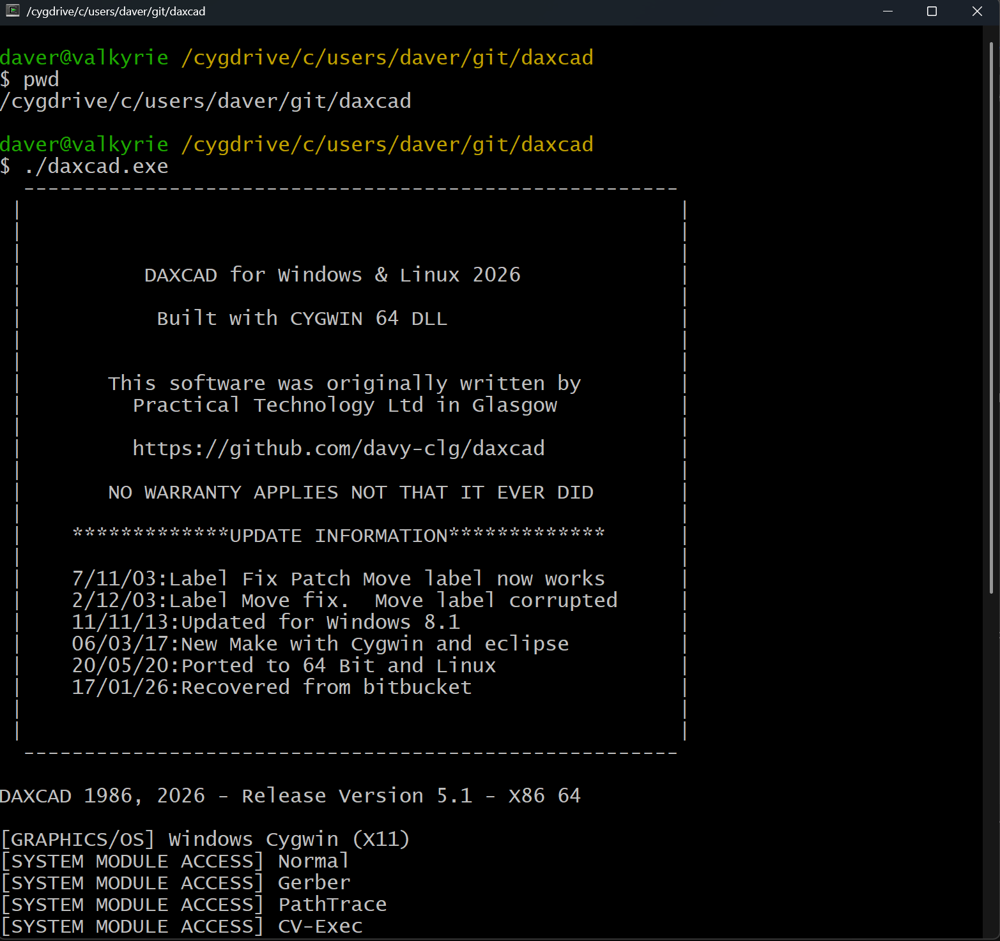
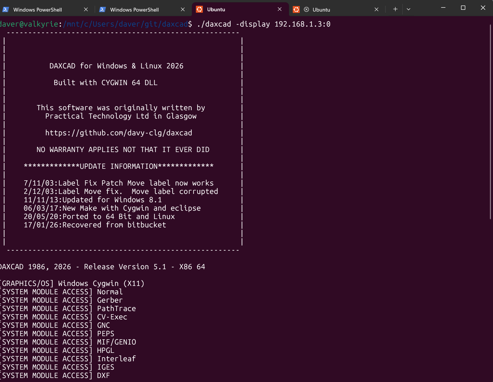

## Synopsis

DAXCAD is a Fortran based CAD package from the 1980s. 

It has a everybodywiki entry and you can read it here since Wikipedia deleted the original entry... 

https://en.everybodywiki.com/Daxcad

I've updated this in 2026 - well why not.  I had the repo on Bitbucket but I'm moving it to github. I've updated a couple of things so that it runs on WSL with WSLg. You can still use an XWindows server on Windows - my recommendation for 2026 is MobXTerm - the best without a doubt.

I found myself still fixing the bugs.  In this case mostly argument between INTEGER*4 and INTEGER*2 types in the Fortran code. But it still all runs. Maybe if I get the time I'll do a podman then it will be easy to just run it.

You can also run it with Cygwin in native Windows and the Makefile is the dame for both. 
So just download the bundle - git clone or download zip. 

So best way is to install cygwin64 - to c:\cywin64 and then cd to the downloaded folder and use the terminal to run it with ./daxcad.exe

You should end up with something like this:

Same for WSL - run WSL and then in a terminal window 

./daxcad -display hostname:0

You can also use WSLg - so you dont need an Xserver - which also works well.

## Code 

Most of the code is Fortran 77 - some bits are C - its a mixture.  The code was originally written for an Apollo Aegis platform and used Apollo GPR.  You can google that.  It was then ported to a PC and used PC based device drivers and a Pharlap Extender.  

The code was also ported to a Sun OS by a partners company and this is the main version here although 98% of the original code was still based on Apollo

In order to port to XWindows - a GPR emulation library was written called GPRX and thats also used here to provide X Window capability 

## Motivation

CAD was expensive in the 80s - DAXCAD made it accessible - AutoCAD did it better - but then they had like way more people.

## Installation

With eclispe you can import this from git and just clone - general project
You need to install CYGWIN on Windows
Ensure you have gcc and gfortran 
run make from the daxcad dir
ensure that the daxcad.4.0 directory is eithr copied or linked to /daxcad.4.0 in your path
then run ./daxcad from a cygwin session

I use xming and that works pretty well 

https://sourceforge.net/projects/xming/

CYGWIN has its own Xserver - just type xstart at the command prompt

## Contributors

A few good people did DAXCAD and given the relativley small number back in the 80s it was a pretty good job

Fork away if you want or let me know and you can be an admin.  

## License

This was a private company but it went bust and the code has passed into the public domain

